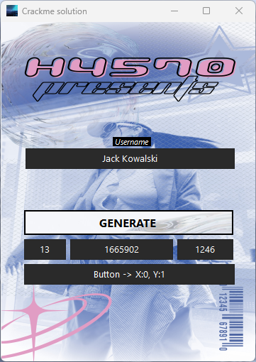

# CrackMe #2 by falcon1

<div align="center">
  
</div>

## Summary 
Difficulty: Easy
Packed: No
Anti-debug: Yes

---

## Description

```
Hi,
This is my first crackme...
It is compiled with masm32.
Don't expect it to any hard(or advanced) at all...
I couldn't decide which packing method to use (UPX or AsPack).
In the end, I chose not to pack it at all...
Here's the scheme:
Using your reversing knowledge you have to
1)Find out which one of the 84(or 54 in hexadecimal) buttons is the right
one that invokes the serial checking routine
2)Write a valid keygenerator
3)There's no three...
It is recommended (for your own practice) that you don't patch the app.
Oh, and one more thing, there is an other way to beat the crackme...
(Using your reversing knowledge again),find out how this can be done...
(or if you are curious and can't figure it out on your own, read 'hints.txt').

That's all..
Good Luck

Falcon1
http://george-v.servegame.com


Remarks:A big thank you goes to all the members of BiW who are always
there at their forums(www.reversing.be) ready to help you in your reversing quest...


Created At:29 July 2005
```
